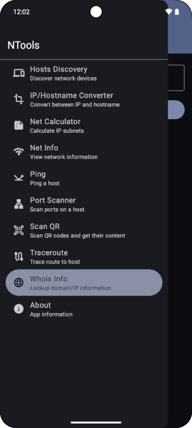
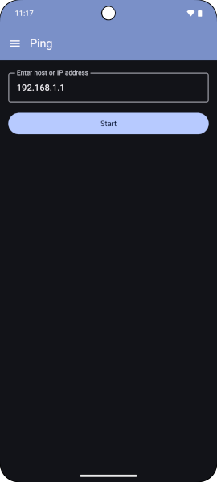
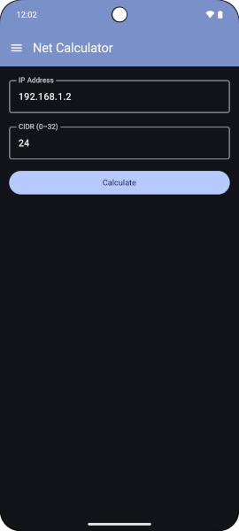
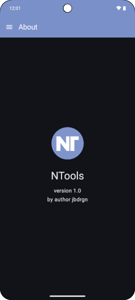

# NTools

Common tools to get and calculate network data 

## Requirements

Android version Min 15 or Android SDK Min 35

[Android version VS Android SDK](https://bintray.com/angelwangjing/maven/traceroute-for-android/_latestVersion)

## Description

Useful network tools:
- Host Discovery
- IP/Hostname Converter
- Net Calculator
- Net Info
- Ping
- Port Scanner
- Scan QR
- Traceroute
- Whois Info

## Previews

